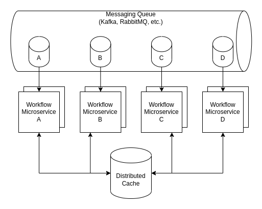
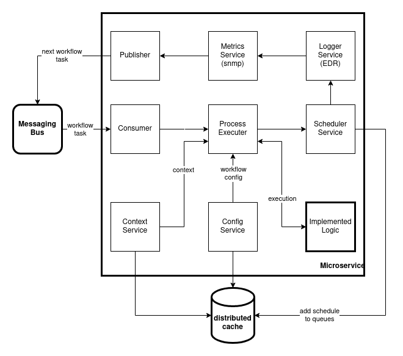

# Linked-Logics Framework #

Linked-Logics is a decentralized workflow execution engine for building distributed, resilient and scalable applications. Linked-Logics has a different approach and is a good candidate for introducing [Sagas](https://microservices.io/patterns/data/saga.html) in microservices. It combines both `orchestration` and `choreography` together by providing DSL for **orchestration** and decentralized execution like in **choreography**. It is very simple to use and has minimal framework footprint.

**Main features:**
- It is decentralized (no single point of failure)
- It is fully event-driven, no syncronous calls
- It is backed by Kafka, RabbitMQ etc.
- It has minimal framework footprint (just one single annotation `@Logic`)
- It provides very powerfull DSL for building complex workflows
- It supports expression language to customize workflows using Groovy, SpEL, JS etc.
- It supports versioning of workflows and logics
- It provides powerfull **compensation** mechanism and error handling required in **Sagas**
- It provides standard **timeout** and **retry** mechanisms
- It supports easy **fork** and **join** workflows
- It supports **asynchronous** logics

## High-Level Architecture ##

### Distributed Cache ###
Distributed cache stores active workflow contexts and workflow definitions.

### Workflow Microservices ###
Microservices are individual applications which take part in workflow execution. They listen to their own queue in the messaging bus and consume only messages related to them. While designing workflows, we need to indicate which microservice will be responsible for each workflow item. Whole architecture is deployed as decentralized model where each microservice takes responsibility to execute the current workflow item and decide on next steps by storing the latest context in cache, identifying next execution step, sending metrics etc.

### Messaging Bus ###
Messaging bus is required since whole architecture is a synchronous. Messaging bus provides different queues for each microservice. 

## Low-Level Architecture ##

Framework add several low level components(services) to each microservice. These services performs basic operations required for workflow execution such as consuming and publishing workflow step info to messaging bus, retrieving and storing latest context information in cache, actual logic execution and error handling. It also follows workflow execution and decides on next steps. Conditional and scripting workflow items are executed on current microservices. Only workflow items requiring a microservice to execute are published to messaging bus.
